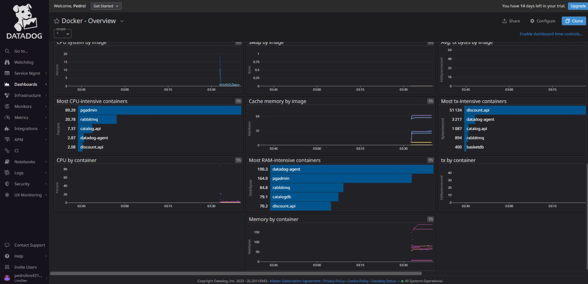
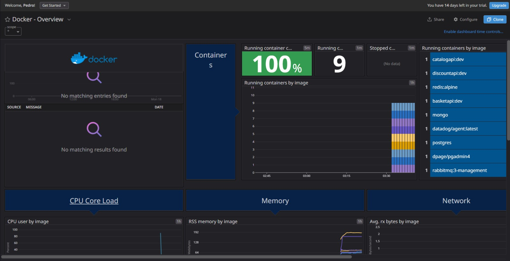
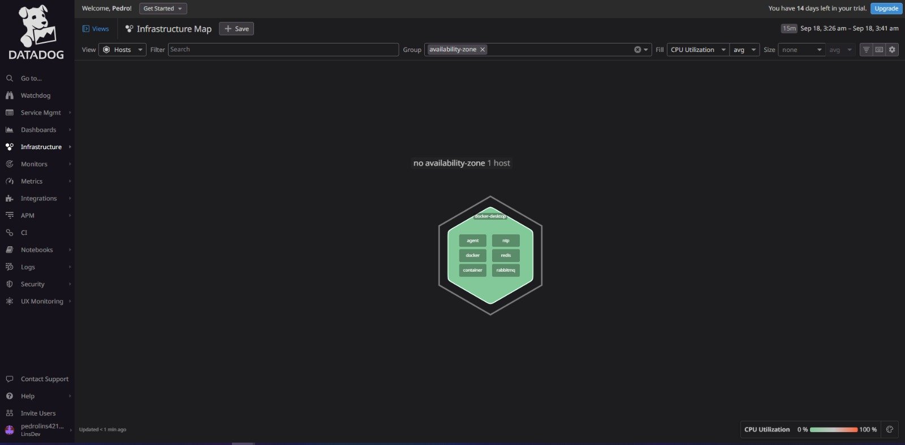
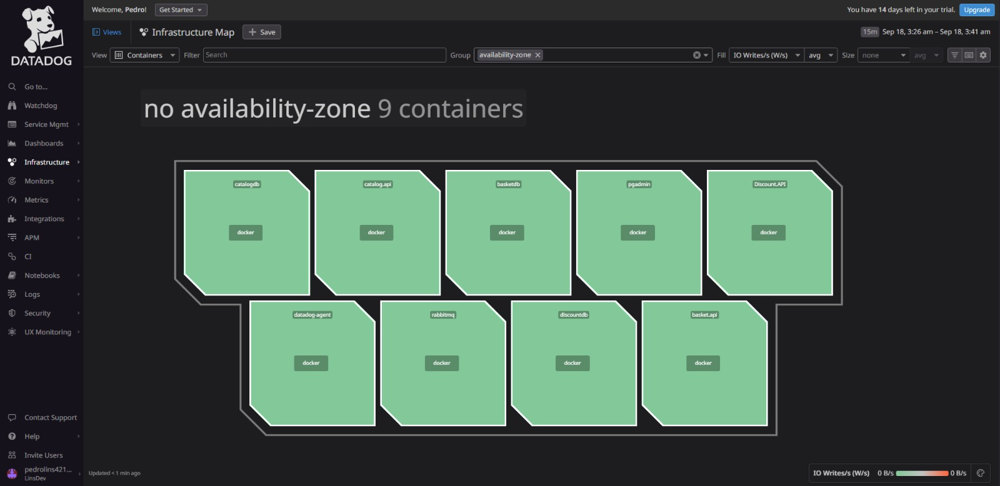
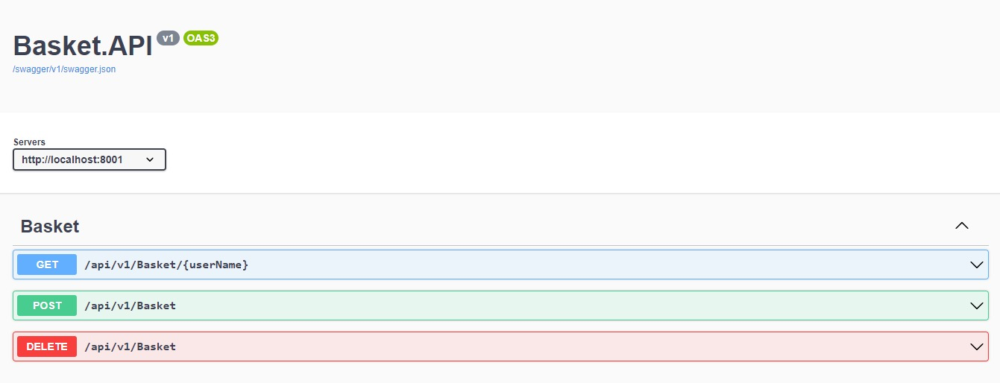
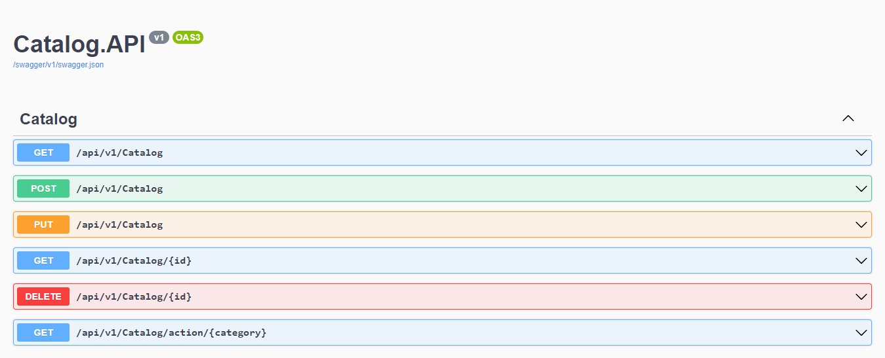
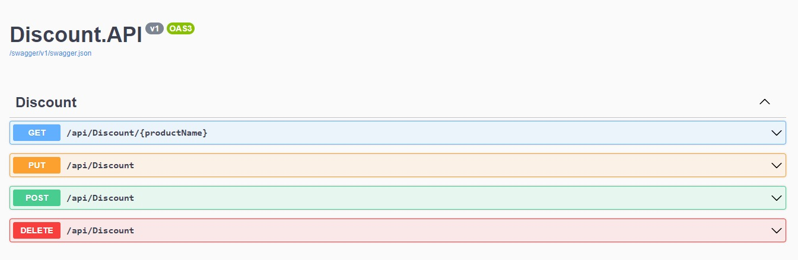

# Microservices


Esta solução é uma Arquitetura Distribuida com 3 Microservices, sendo eles:

1 - Cesta de Compra;

2 - Catálog de Produtos;

3 - Descontos de Produtos;

Uma integração foi feita com o Datadog para efetuar a observabilidade da solução nos containers do Docker.

## Tecnologias Utilizadas

- [.NET](https://dotnet.microsoft.com/) - Framework para C#.
- [Docker](https://www.docker.com/) - O Docker é um software de código aberto usado para implantar aplicativos dentro de containers virtuais..
- [RabbitMQ](https://www.rabbitmq.com) - O RabbitMQ é um software de mensagens com código aberto.
- [PostgreSQL](https://www.postgresql.org/) - PostgreSQL é um sistema gerenciador de banco de dados objeto relacional.
- [MongoDB](https://www.mongodb.com/) - MongoDB é um software de banco de dados orientado a documentos livre, de código aberto.
- [Redis](https://redis.io/) - Redis é um armazenamento de estrutura de dados em memória, usado como um banco de dados em memória distribuído de chave-valor.
- [Datadog](https://www.datadoghq.com/) - O Datadog é um software que fornece um SaaS de observabilidade para serviços em nuvem.

## Como Executar

1. Clone o repositório e acesse a pasta do projeto
   ```shell
   git clone https://github.com/LinsDeveloper/Microservices.git
    ```
2. Instale os pacotes utilizado na solução;
3. Instale o Docker com Conta no Docker HUB.
4. Execute Docker-Compose.
5. Acesse a url: http://localhost:5050/login
6. Entre com as credenciais: login e senha -> admin@teste.com && admin1234
7. Crie uma tabela com o script SQL abaixo :

    ```shell
        CREATE TABLE Persons (
                                Id int IDENTITY(1,1) PRIMARY KEY,
                                ProductName VARCHAR(100),
                                Description VARCHAR(100),
                                Amount INT
                                
                            );
    ```


# Datadog







## Basket (.NET + Redis[Cache])
### http://localhost:8001/swagger/index.html


## Catalog (.NET + MongoDB)
### http://localhost:8000/swagger/index.html


## Discount (.NET + PostgreSQL)
### http://localhost:8002/swagger/index.html



## Licença

Esse projeto está licenciado pelo [MIT License](https://github.com/LinsDeveloper/NLprod/blob/main/LICENSE).
